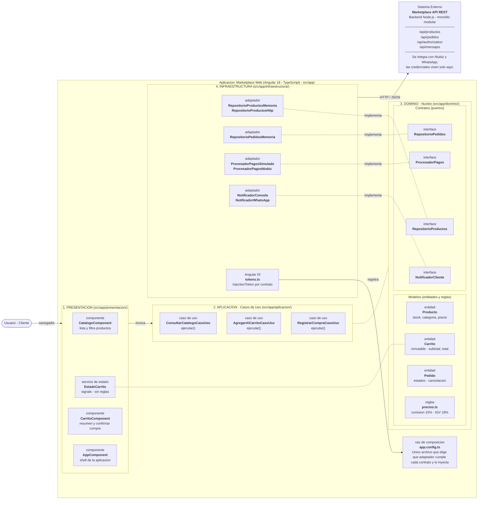

# Enfoque Arquitectónico: Clean Architecture

| Elemento | Descripción Aplicada al Marketplace |
| :--- | :--- |
| **Patrón / Enfoque** | Clean Architecture (Arquitectura Limpia). |
| **Objetivo** | Separar responsabilidades y controlar las dependencias hacia el dominio. |
| **¿Qué problema resuelve?** | Evita el acoplamiento entre la interfaz Angular, las reglas del negocio y las tecnologías externas (API, BD, servicios de pago). |
| **Capas definidas** | Presentación, Aplicación, Dominio e Infraestructura. |
| **Beneficios** | • Facilita el mantenimiento y las pruebas unitarias. • Permite cambiar tecnologías sin alterar la lógica de negocio. • Mejora la organización del código. |

---

## Diagrama de Clean Architecture (Frontend Angular)

