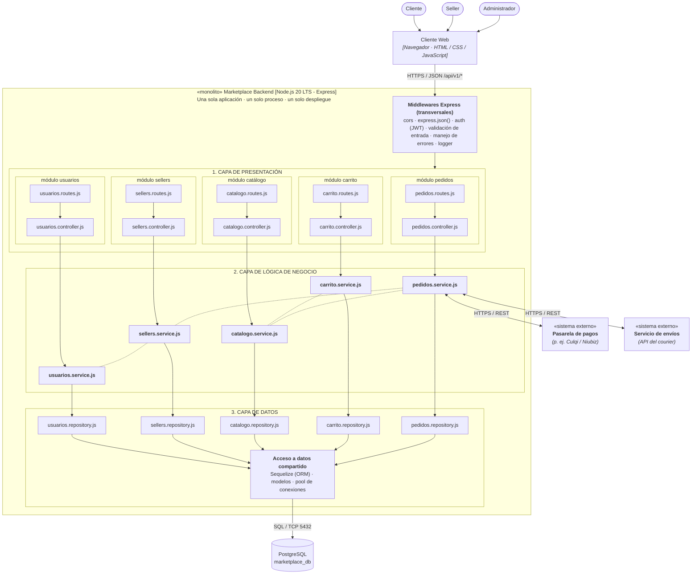

# Estilo Arquitectónico Seleccionado

**Estilo:** Monolito Modular con Organización en Capas.

## Justificación
Permite mantener todo el sistema en una única unidad de despliegue para simplificar la infraestructura inicial, mientras mantiene una separación lógica estricta por módulos (Usuarios, Sellers, Catálogo, Carrito, Pedidos) para facilitar la escalabilidad futura y la mantenibilidad.

## Diagrama de Arquitectura (Monolito Backend)

